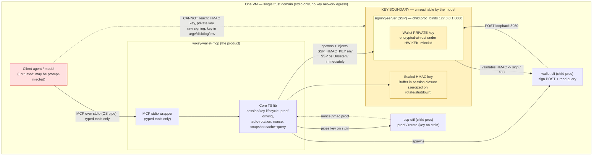
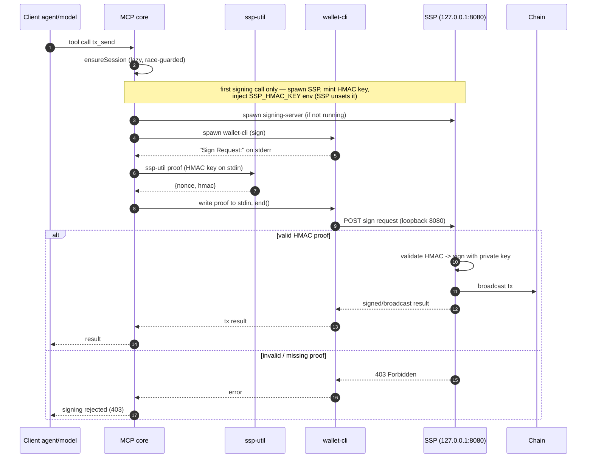
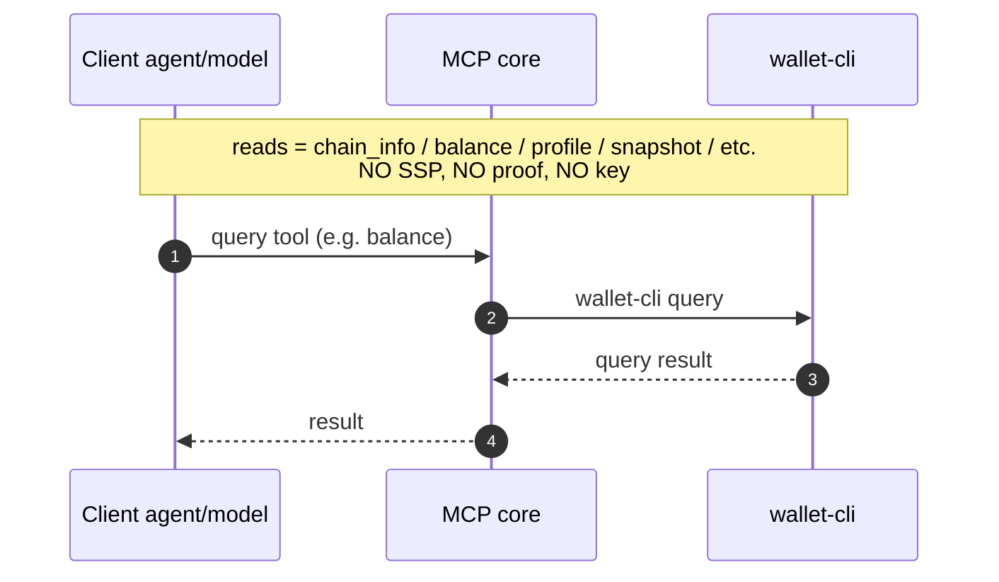
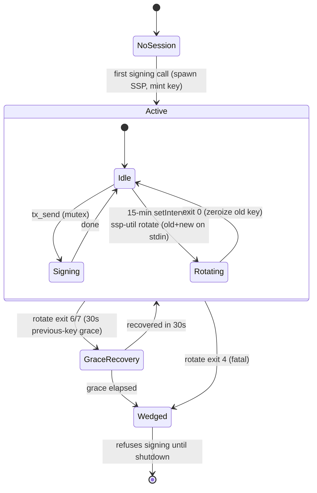
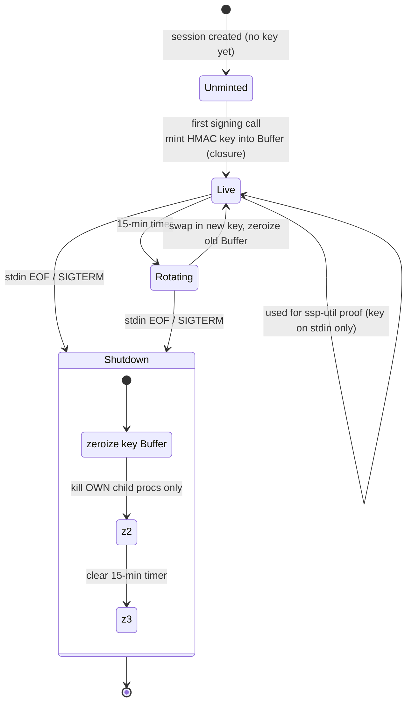
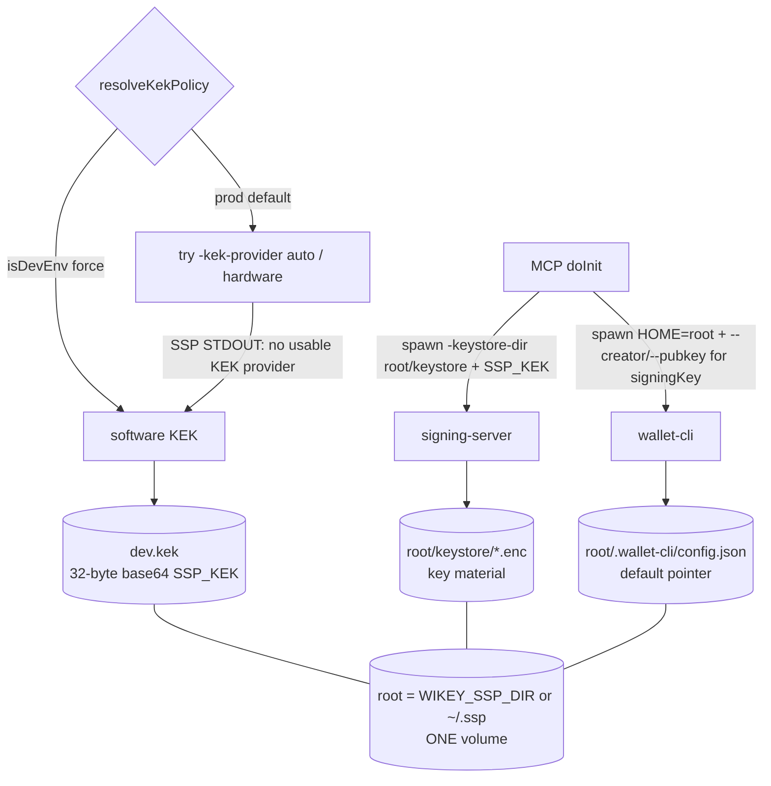
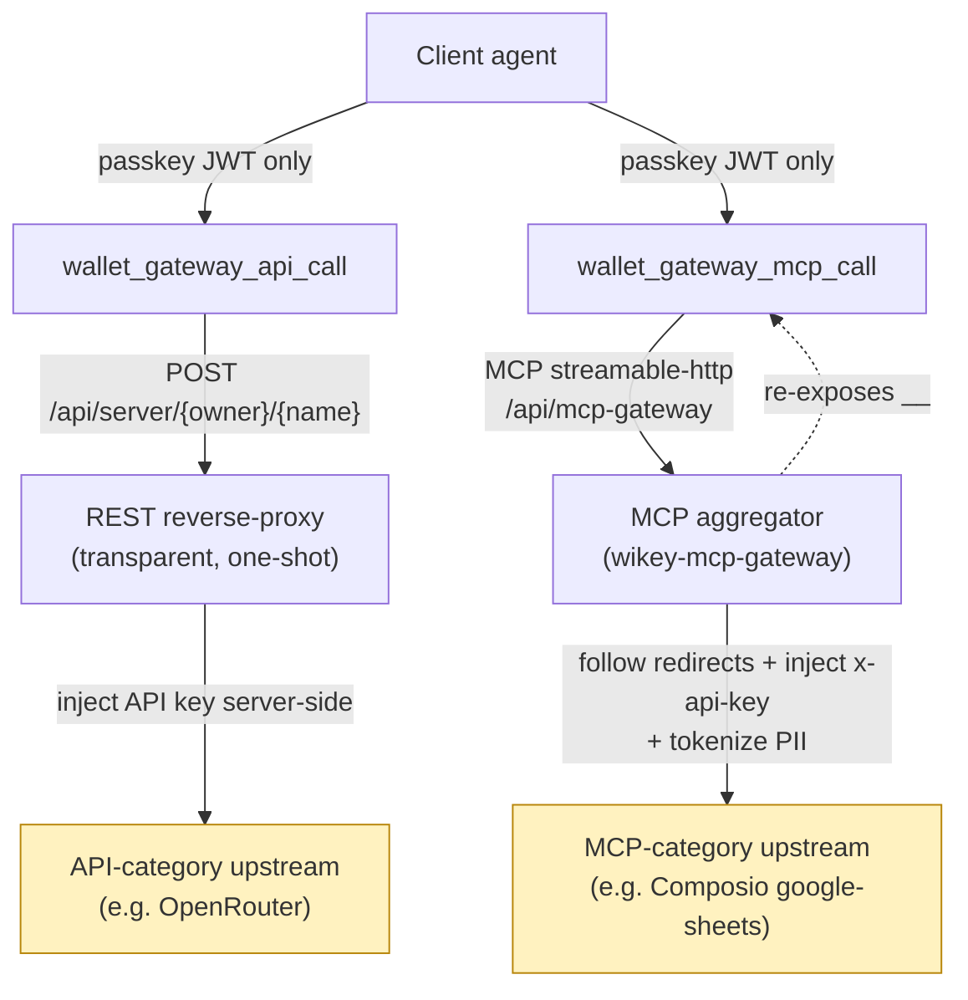

# Architecture

Greenfield ESM TypeScript, Node 22+. Two layers:

```
src/core/         ← pure, transport-agnostic logic (ported from the frozen skill)
src/mcp-server.ts ← MCP stdio wrapper (bin entry; THE product)
```

Core is independently unit-testable with no transport. The wrapper registers
typed tools via `@modelcontextprotocol/sdk` over `StdioServerTransport` and maps
each to core. The model reaches **only** these typed tools over a private OS
pipe.

## Component map

| Module                 | Responsibility |
| ---------------------- | -------------- |
| `core/session.ts`      | SessionManager: sealed HMAC key Buffer, lazy/race-guarded `ensureSession`, own-child tracking, nonce lifecycle, auto-rotation timer, wedged flag, shutdown. |
| `core/proof.ts`        | `computeProof` + `parseSignRequest`; SIGTERM→SIGKILL kill ladder. |
| `core/signing.ts`      | `runSigningPrompted` (dual timeout, stdin-end discipline) + policy/edit-helpers prompt queues. |
| `core/query.ts`        | `runQuery` (reads, 30s). |
| `core/rotation.ts`     | `runHmacRotation` + `ssp-util` exit-code table + grace recovery; `mintKey`. |
| `core/snapshot.ts`     | `parseSnapshot` + resolvers (create-user / delete-user / delete-policy) + types. |
| `core/snapshotCache.ts`| B2 server-side store: index / query / page, byte-budgeted, last-3 + TTL. |
| `core/binPaths.ts`     | Resolve `signing-server`/`ssp-util`/`wallet-cli`; KEK policy (hardware→software fallback); single state root (`stateRoot`/`keystoreDir`/`walletHome`/`walletCliEnv`). |
| `core/installer.ts`    | Locate `WIKEY_INSTALL_SCRIPT` → `~/.ssp` fallback; auto-run on startup. |
| `core/mutex.ts`        | Async mutex shared by ensureSession + signing + rotation. |
| `core/redact.ts`       | Defensive secret scrubber for error strings. |
| `core/configLock.ts`   | Security-critical config-key lockdown. |
| `mcp-server.ts`        | Tool registry, dispatch, config lockdown, `doctor`, signal/stdin-EOF wiring. |

---

## 1. Component / trust boundary

The model reaches only typed tools over stdio; both keys sit inside an
unreachable key boundary.



ASCII fallback:

```
+=============================================================================+
|  ONE VM  —  single trust domain   (stdio only; keys never leave on network) |
|   [ Client agent / model ]   <-- UNTRUSTED (may be prompt-injected)         |
|            |  MCP over stdio (OS pipe) — typed tools ONLY                    |
|            v                                                                |
|   +-------------------------------------------------+                       |
|   |  wikey-wallet-mcp  (THE PRODUCT)                |                       |
|   |   [ MCP stdio wrapper ]                         |                       |
|   |   [ Core TS lib: session/key, proof, rotation,  |                       |
|   |     nonce, snapshot cache+query ]               |                       |
|   +-------------------------------------------------+                       |
|        | spawns      | spawns         | spawns + inject SSP_HMAC_KEY env     |
|        | (key stdin) |                | (SSP os.Unsetenv immediately)        |
|        v             v                v                                     |
|   [ ssp-util ]   [ wallet-cli ]   //=========== KEY BOUNDARY ============\\ |
|   proof/rotate   sign POST /      ||  unreachable by the model           || |
|        ^         read query       ||  ( HMAC key: Buffer in closure,     || |
|        | proof   |   POST 8080     ||    zeroized on rotate/shutdown )     || |
|        +---------|---------------> ||  +-------------------------------+   || |
|                  | validate HMAC   ||  | signing-server (SSP)          |   || |
|                  +---------------> ||  |  binds 127.0.0.1:8080         |   || |
|                    -> sign / 403   ||  |  [ wallet PRIVATE key ]       |   || |
|                                    ||  |  enc-at-rest HW KEK, mlock'd  |   || |
|                                    ||  +-------------------------------+   || |
|                                    \\=====================================// |
|   Model CANNOT reach: HMAC key, private key, raw signing, key via           |
|                       argv / disk / log / other env.                        |
+=============================================================================+
```

## 2. Signing sequence

Lazy spawn, `ssp-util` proof, SSP signs on a valid HMAC (else 403), core
re-queries the snapshot for real post-state.



## 3. Read sequence

Plain query, no SSP / proof / key.



## 4. Auto-rotation state machine

15-min timer; exit 6/7 → 30s grace; exit 4 / grace-elapsed → wedged.



## 5. Session / key lifecycle

Mint on first signing call → rotate (zeroize old) → shutdown on stdin EOF /
SIGTERM (zeroize + kill own children + clear timer).



## 6. Snapshot data-flow (H14)

Raw JSON stays server-side; only bounded derived answers reach the model. The
boundary is **size-bounded, not shape-bounded**: every field stays reachable
(`fields` selection on `_query`/`_page`, one complete object via `_object`),
and every cut — rows or fields — is explicitly reported, never silent.

Because the budget applies to `_object` too, a large object comes back trimmed,
and re-reading it returns the same trim. `fields` on `_object` is the rung above
that: it narrows the read to named payload keys and/or the `process` / `name` /
`isValid` siblings, so a field the full read could not carry still fits on its
own. **Asking for less is how you get more.** On a real 9 MB profile this
recovered 272 of 278 budget-dropped fields, including 253/253 `process` blocks;
the residual six are single values larger than the whole budget (up to 18 KB)
and need `WIKEY_SNAPSHOT_MAX_RESULT_BYTES` raised. A requested key the object
does not have is returned in `unknownFields`, so an empty payload is never
ambiguous.

```mermaid
graph LR
    A["Client model"] -->|wallet_snapshot / _query / _page / _object| M["MCP core"]
    M -->|query snapshot| W["wallet-cli"]
    W -->|RAW JSON (can be MBs)| M
    M -->|parseSnapshot + cache| CACHE["snapshotCache (in-memory, last-3, TTL, total-bytes cap)"]
    M -->|"index + fields map / rows / page / object<br/>byte-budgeted + {truncated,total,nextOffset} / omittedFields"| A
    M -. "RAW snapshot JSON NEVER returned" .-x A
    classDef secret fill:#fff2c0,stroke:#b8860b;
    class CACHE secret;
```

## 7. State persistence & KEK fallback

All durable wallet state lives under **one root** — `WIKEY_SSP_DIR`, default
`~/.ssp`. The SSP keystore, the software KEK (`dev.kek`), the child binaries, and
wallet-cli's config (the default-key pointer) all derive from it, so a single
operator volume on the root makes the stack restart-stable and the key material
can never desync from the "which key is default" pointer. The agent's `mcp.json`
stays bare; persistence is purely an operator concern.

```
                          mcp.json = { "command": "wikey-wallet-mcp" }   ← bare
   ┌─────────────────────────────────────────────────────────────────────┐
   │ MCP doInit(): try -kek-provider auto (hardware)                       │
   │        └─ SSP logs "no usable KEK provider" on STDOUT → fall back ONCE│
   │           to -kek-provider env + SSP_KEK (from dev.kek)               │
   │                                                                       │
   │   signing-server  -keystore-dir <root>/keystore        wallet-cli     │
   │        │                                              HOME=<root>      │
   │        ▼                                                  │            │
   │   <root>/keystore/*.enc  (key material)                   ▼            │
   │                                          <root>/.wallet-cli/config.json│
   │                                          (user.address/pubkey = default│
   │                                           pointer; signer.url 127.0.0.1│
   │  ┌──────── <root> = $WIKEY_SSP_DIR | ~/.ssp ──────────────────────┐   │
   │  │  bin/   keystore/*.enc   dev.kek   .wallet-cli/config.json      │   │ ← ONE volume
   │  └────────────────────────────────────────────────────────────────┘  │
   └─────────────────────────────────────────────────────────────────────┘
```



A per-call `signingKey` on the signing tools resolves to `--creator/--pubkey`
(via `keys get`), letting the agent sign with a chosen funded key when the
default has drifted — without any wallet-cli change.

## 8. Gateway (Casdoor) integration — REST vs MCP surfaces

`src/core/idp/` lets the agent reach **third-party services through an enrolled
gateway** (a Casdoor fork) authorized **only** by the wallet passkey — the agent
never holds the upstream credential. The upstream API key / MCP `x-api-key` /
OAuth secret stays on the gateway, which injects it server-side after casbin-gating
the caller's short-lived passkey JWT.

**Auth (identical for both surfaces).** `wallet_gateway_register` binds the
passkey to the wallet's SAFE (recovery-proof); `wallet_gateway_login` mints an
OAuth JWT by creating, **on-chain**, the FIDO-sign object Casdoor's `ValidateObject`
checks (only the safe owner can — the real Level-3 proof). The signing rides the
same sealed session as every other tool (`login.ts` takes an injected `LoginSigner`;
the HMAC + private keys never cross the boundary). The minted JWT carries the
caller's casbin permissions (`amr:["fido"]`) and is the ONLY credential sent
downstream.

**Two proxy surfaces, by `Server.Category`.** The gateway hosts registered
`Server` objects on two different routes, and the wallet has one tool for each —
they are **not** a fallback chain; the agent picks by what it is calling:

| Tool | Route | For | Transport |
| ---- | ----- | --- | --------- |
| `wallet_gateway_api_call` (`apiCall.ts`) | `/api/server/{owner}/{name}/{subpath}` | **API-category** servers (e.g. OpenRouter) | one HTTP request in, raw response out |
| `wallet_gateway_mcp_call` (`mcpCall.ts`) | `/api/mcp-gateway` | **MCP-category** servers (e.g. google-sheets via Composio) | full MCP `streamable-http` (`initialize` → `tools/list` / `tools/call`) |

The REST proxy is a *transparent single-shot reverse-proxy* — perfect for a plain
API, but it is **not an MCP client**. Point it at an MCP server and it just relays
that server's own transport handshake back to the caller (e.g. Composio answers
`307 → /v3/mcp/<id>/mcp`), which dead-ends: the relative redirect resolves to the
gateway's SPA, and following it direct-to-upstream returns `401` because only the
gateway holds the `x-api-key`.

The aggregator (`/api/mcp-gateway`, `serverInfo: wikey-mcp-gateway`) is a **real
MCP server** that connects to each granted upstream MCP itself — following its
redirects, injecting the upstream credential server-side, and tokenizing PII —
then re-exposes every tool namespaced `<server>__<TOOL>` (e.g.
`google-sheets-mcp__GOOGLESHEETS_VALUES_GET`). It accepts the passkey JWT **alone**
(no shared service key), deriving the PII user from the token. That is why MCP
servers must go through `wallet_gateway_mcp_call`, not `wallet_gateway_api_call`.



Both tools acquire the token the same way: reuse an `accessToken` from a prior
`wallet_gateway_login`, or omit it to perform a fresh on-chain login inline.
