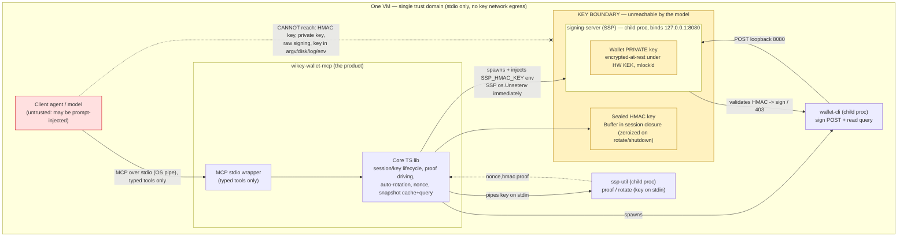
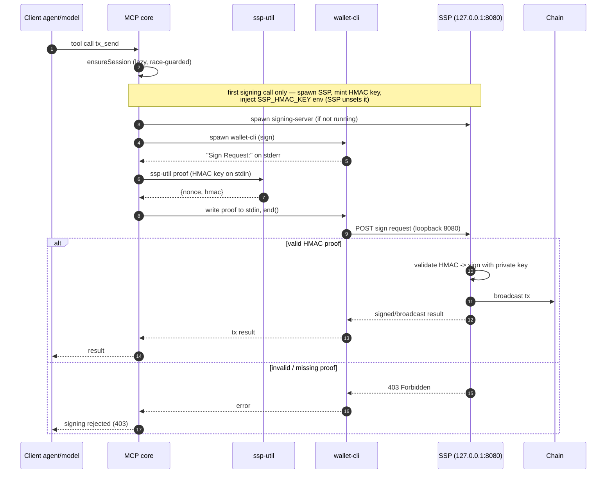
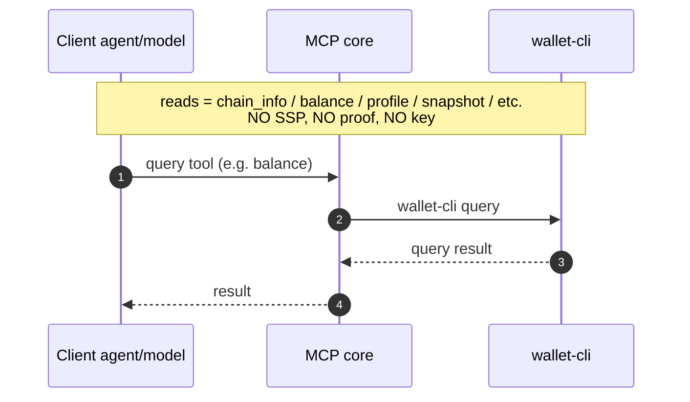
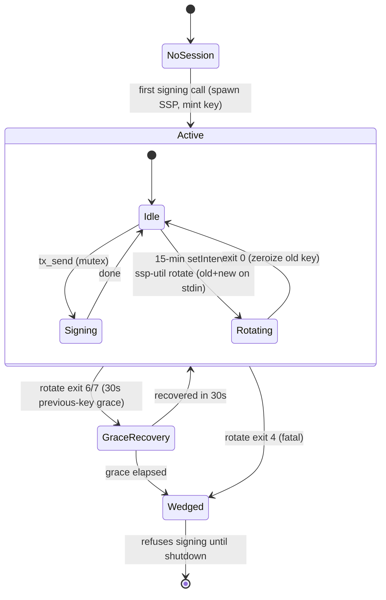
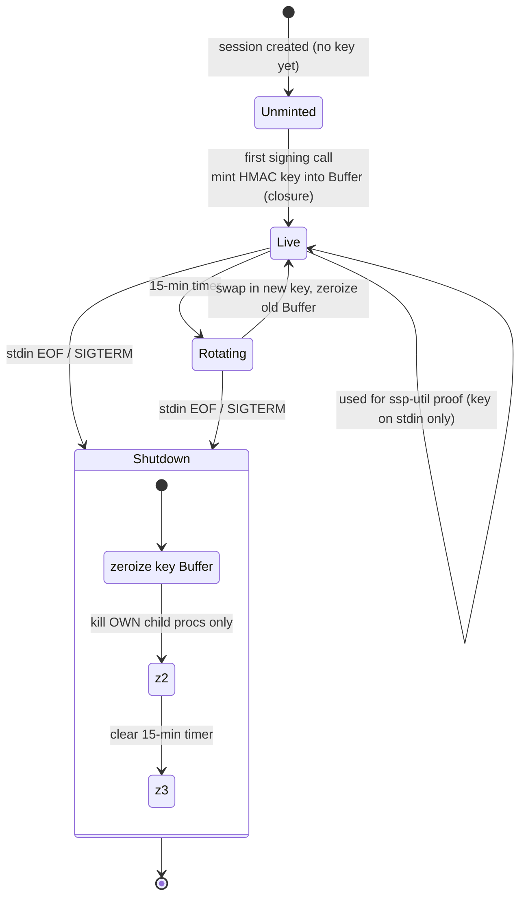
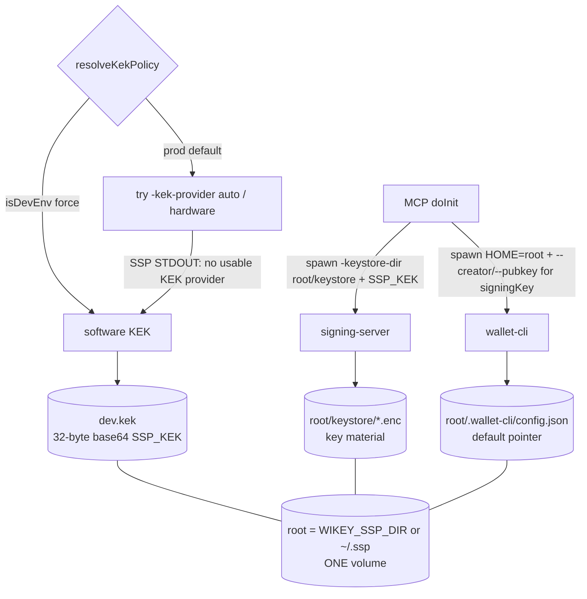
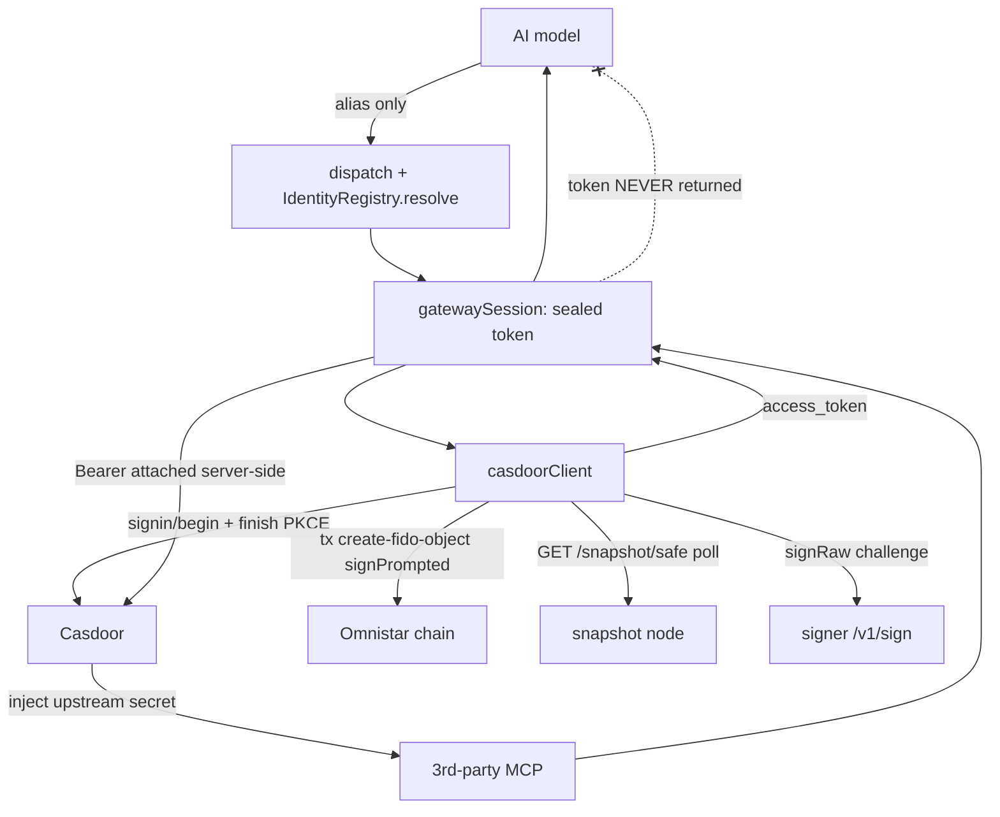

# Architecture

Greenfield ESM TypeScript, Node 22+. Two layers:

```
src/core/         ← pure, transport-agnostic logic (ported from the frozen skill)
src/mcp-server.ts ← MCP stdio wrapper (bin entry; THE product)
```

Core is independently unit-testable with no transport. The wrapper registers
typed tools via `@modelcontextprotocol/sdk` over `StdioServerTransport` and maps
each to core. The model reaches **only** these typed tools over a private OS
pipe.

## Component map

| Module                 | Responsibility |
| ---------------------- | -------------- |
| `core/session.ts`      | SessionManager: sealed HMAC key Buffer, lazy/race-guarded `ensureSession`, own-child tracking, nonce lifecycle, auto-rotation timer, wedged flag, shutdown. |
| `core/proof.ts`        | `computeProof` + `parseSignRequest`; SIGTERM→SIGKILL kill ladder. |
| `core/signing.ts`      | `runSigningPrompted` (dual timeout, stdin-end discipline) + policy/edit-helpers prompt queues. |
| `core/query.ts`        | `runQuery` (reads, 30s). |
| `core/rotation.ts`     | `runHmacRotation` + `ssp-util` exit-code table + grace recovery; `mintKey`. |
| `core/snapshot.ts`     | `parseSnapshot` + resolvers (create-user / delete-user / delete-policy) + types. |
| `core/snapshotCache.ts`| B2 server-side store: index / query / page, byte-budgeted, last-3 + TTL. |
| `core/binPaths.ts`     | Resolve `signing-server`/`ssp-util`/`wallet-cli`; KEK policy (hardware→software fallback); single state root (`stateRoot`/`keystoreDir`/`walletHome`/`walletCliEnv`). |
| `core/installer.ts`    | Locate `WIKEY_INSTALL_SCRIPT` → `~/.ssp` fallback; auto-run on startup. |
| `core/mutex.ts`        | Async mutex shared by ensureSession + signing + rotation. |
| `core/redact.ts`       | Defensive secret scrubber for error strings (HMAC keys + JWTs). |
| `core/configLock.ts`   | Security-critical config-key lockdown. |
| `core/webauthn.ts`     | Pure FIDO3 authenticator: CBOR/COSE, attestation/assertion, uuid, `xyFromUncompressed`. node:crypto only. |
| `core/identityRegistry.ts` | Operator-only alias→bundle resolver (env + live `<root>/casdoor-identities.json`); per-alias bootstrap password. |
| `core/casdoorIdentity.ts`  | Wallet↔Casdoor bridge: read safe ecPuk, build `create-fido-object` args, `signChallengeViaSSP`, poll `/snapshot/safe`, per-alias credential store. |
| `core/casdoorClient.ts`    | All outbound Casdoor HTTP: cookie jar, register, PKCE login (+ on-chain FIDO object + token exchange), gateway proxy call. |
| `core/gatewaySession.ts`   | Sealed map alias→{token,expiresAt}; `ensureToken`/`register`/`login`/`call`/`status`/`shutdown`. Token NEVER returned. |
| `mcp-server.ts`        | Tool registry, dispatch, config lockdown, `doctor`, gateway wiring, signal/stdin-EOF wiring. |

---

## 1. Component / trust boundary

The model reaches only typed tools over stdio; both keys sit inside an
unreachable key boundary.



ASCII fallback:

```
+=============================================================================+
|  ONE VM  —  single trust domain   (stdio only; keys never leave on network) |
|   [ Client agent / model ]   <-- UNTRUSTED (may be prompt-injected)         |
|            |  MCP over stdio (OS pipe) — typed tools ONLY                    |
|            v                                                                |
|   +-------------------------------------------------+                       |
|   |  wikey-wallet-mcp  (THE PRODUCT)                |                       |
|   |   [ MCP stdio wrapper ]                         |                       |
|   |   [ Core TS lib: session/key, proof, rotation,  |                       |
|   |     nonce, snapshot cache+query ]               |                       |
|   +-------------------------------------------------+                       |
|        | spawns      | spawns         | spawns + inject SSP_HMAC_KEY env     |
|        | (key stdin) |                | (SSP os.Unsetenv immediately)        |
|        v             v                v                                     |
|   [ ssp-util ]   [ wallet-cli ]   //=========== KEY BOUNDARY ============\\ |
|   proof/rotate   sign POST /      ||  unreachable by the model           || |
|        ^         read query       ||  ( HMAC key: Buffer in closure,     || |
|        | proof   |   POST 8080     ||    zeroized on rotate/shutdown )     || |
|        +---------|---------------> ||  +-------------------------------+   || |
|                  | validate HMAC   ||  | signing-server (SSP)          |   || |
|                  +---------------> ||  |  binds 127.0.0.1:8080         |   || |
|                    -> sign / 403   ||  |  [ wallet PRIVATE key ]       |   || |
|                                    ||  |  enc-at-rest HW KEK, mlock'd  |   || |
|                                    ||  +-------------------------------+   || |
|                                    \\=====================================// |
|   Model CANNOT reach: HMAC key, private key, raw signing, key via           |
|                       argv / disk / log / other env.                        |
+=============================================================================+
```

## 2. Signing sequence

Lazy spawn, `ssp-util` proof, SSP signs on a valid HMAC (else 403), core
re-queries the snapshot for real post-state.



## 3. Read sequence

Plain query, no SSP / proof / key.



## 4. Auto-rotation state machine

15-min timer; exit 6/7 → 30s grace; exit 4 / grace-elapsed → wedged.



## 5. Session / key lifecycle

Mint on first signing call → rotate (zeroize old) → shutdown on stdin EOF /
SIGTERM (zeroize + kill own children + clear timer).



## 6. Snapshot data-flow (H14)

Raw JSON stays server-side; only bounded derived answers reach the model.

```mermaid
graph LR
    A["Client model"] -->|wallet_snapshot / _query / _page| M["MCP core"]
    M -->|query snapshot| W["wallet-cli"]
    W -->|RAW JSON (can be 100s of KB)| M
    M -->|parseSnapshot + cache| CACHE["snapshotCache (in-memory, last-3, TTL)"]
    M -->|"index ~300B / matched rows / page<br/>byte-budgeted + {truncated,total,nextOffset}"| A
    M -. "RAW snapshot JSON NEVER returned" .-x A
    classDef secret fill:#fff2c0,stroke:#b8860b;
    class CACHE secret;
```

## 7. State persistence & KEK fallback

All durable wallet state lives under **one root** — `WIKEY_SSP_DIR`, default
`~/.ssp`. The SSP keystore, the software KEK (`dev.kek`), the child binaries, and
wallet-cli's config (the default-key pointer) all derive from it, so a single
operator volume on the root makes the stack restart-stable and the key material
can never desync from the "which key is default" pointer. The agent's `mcp.json`
stays bare; persistence is purely an operator concern.

```
                          mcp.json = { "command": "wikey-wallet-mcp" }   ← bare
   ┌─────────────────────────────────────────────────────────────────────┐
   │ MCP doInit(): try -kek-provider auto (hardware)                       │
   │        └─ SSP logs "no usable KEK provider" on STDOUT → fall back ONCE│
   │           to -kek-provider env + SSP_KEK (from dev.kek)               │
   │                                                                       │
   │   signing-server  -keystore-dir <root>/keystore        wallet-cli     │
   │        │                                              HOME=<root>      │
   │        ▼                                                  │            │
   │   <root>/keystore/*.enc  (key material)                   ▼            │
   │                                          <root>/.wallet-cli/config.json│
   │                                          (user.address/pubkey = default│
   │                                           pointer; signer.url 127.0.0.1│
   │  ┌──────── <root> = $WIKEY_SSP_DIR | ~/.ssp ──────────────────────┐   │
   │  │  bin/   keystore/*.enc   dev.kek   .wallet-cli/config.json      │   │ ← ONE volume
   │  └────────────────────────────────────────────────────────────────┘  │
   └─────────────────────────────────────────────────────────────────────┘
```



A per-call `signingKey` on the signing tools resolves to `--creator/--pubkey`
(via `keys get`), letting the agent sign with a chosen funded key when the
default has drifted — without any wallet-cli change.

## 8. Casdoor MCP gateway — FIDO passkey login (additive subsystem)

The wallet can log into a **Casdoor** identity server **as a passkey** and then
call **third-party MCP servers through Casdoor's MCP gateway** — without ever
holding the third party's secret (Casdoor injects it) and without the OAuth
token ever reaching the model. This is the **first outbound HTTP** the server
makes (previously loopback + installer only); the three new hosts are **Casdoor**,
the **snapshot node**, and the **loopback signer** (`/v1/sign`).

Why passkey login works: Casdoor's Go WebAuthn library cannot verify our ES256K
signature, so on verify-failure it falls back to checking the **Omnistar chain**
for a small **FIDO object** on the user's *safe* (`uuid = sha256(clientDataJSON)
[:16]`). Only the safe owner can create that object, so **creating it on-chain is
the real proof of identity** — and because it binds to the *safe* key (not the
account key), login survives account recovery. Login therefore produces two
artifacts: the on-chain object (a normal `tx create-fido-object`, signed +
broadcast via `signPrompted`) and the WebAuthn challenge signature (caller-bytes,
NOT broadcast, via the generic `session.signRaw` → `/v1/sign`).

```
   model ──(alias only; no URLs)──> wallet_gateway_{register,login,list_tools,call,status,list_identities}
                                          │
   identityRegistry.resolve(alias) ───────┤  (operator env + <root>/casdoor-identities.json)
                                          v
   gatewaySession (sealed token, NEVER returned) ── ensureToken ──> casdoorClient.login
        │                                                              │  PKCE, no client_secret
        │ call/list_tools (Bearer attached server-side, redacted out)  ├─ signin/begin  ─> Casdoor
        v                                                              ├─ create-fido-object (signPrompted) ─> chain
   Casdoor /api/server/{owner}/{name} ──inject upstream secret──> 3rd-party MCP
                                                                       ├─ waitForObjectValid GET /snapshot/safe
                                                                       ├─ signRaw challenge ─> signer /v1/sign
                                                                       └─ token exchange ─> sealed in gatewaySession
```



New-module roles: **`identityRegistry`** is the operator/model trust boundary —
the model passes an *alias*, every URL comes from operator config (env or the
live-reloaded JSON file), so there is no SSRF/phishing channel. **`webauthn`** is
the pure, deterministic credential builder. **`casdoorIdentity`** bridges wallet
reads/signing to the Casdoor flow. **`casdoorClient`** is the one auditable place
for all Casdoor HTTP. **`gatewaySession`** seals the token like the HMAC key.
